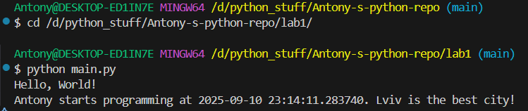

# Звіт до роботи
## Тема: _Вступні заняття: оформлення робіт та перша програма_
### Мета роботи: _Налаштувати середовище для роботи з Python, створити репозиторій GitHub, створити інтеграцію з Visual Studio Code, написати першу програму та оформити звіт з використанням Mark Down_

---
### Виконання роботи
* Результати виконання завдань:
    1. Створили репозиторій та почали працювати з ним;
    2. Згідно з інтсрукцій створили першу програму та запустили її:
        - запуск з Visual Studio Code 
        - запустили з консолі \
        
    3. Модифікував змінні у програмі
        ```
        name = "Antony"
        ```
    4. Створили Jupyter notebook та написали першу програму в комірці [file Notebook](nb.ipynb)
        - Всі комірки виконались
    5. Навчились запускати програму на Python та працювати з Jupyter.

* результати виконання індивідуального завдання (якщо такі є);


* виконали всі інструкції та написали звіт.
---
### Висновок:
> у висновку потрібно відповісти на запитання:

- :question: Що зроблено в роботі;
> Нічого
- :question: Чи досягнуто мети роботи;
> True
- :question: Які нові знання отримано;
> Створення та користування файлів .ipynb з використанням Jupyter
- :question: Чи вдалось відповісти на всі питання задані в ході роботи;
> True
- :question: Чи вдалося виконати всі завдання;
> True
- :question: Чи виникли складності у виконанні завдання;
> False
- :question: Чи подобається такий формат здачі роботи (Feedback);
> True
- :question: Побажання для покращення (Suggestions);
> Щастя, здоров'я, племінників багато.

---